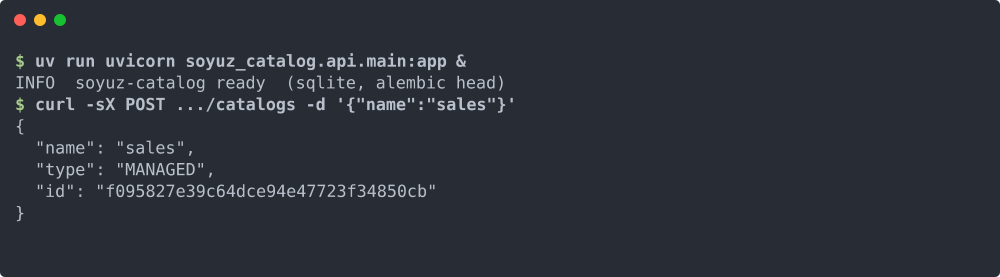

<div align="center">



# soyuz-catalog

**A clean Python reference implementation of the [Unity Catalog REST API spec](https://github.com/unitycatalog/unitycatalog).**

FastAPI + SQLAlchemy. No JVM. No half-finished endpoints.

[](https://www.python.org/)
[](LICENSE)
[](https://github.com/FloHofstetter/soyuz-catalog/actions/workflows/test.yml)
[](https://github.com/FloHofstetter/soyuz-catalog/actions/workflows/spec-drift.yml)

[Docs](https://flohofstetter.github.io/soyuz-catalog/) ·
[Quickstart](https://flohofstetter.github.io/soyuz-catalog/getting-started/quickstart/) ·
[API reference](https://flohofstetter.github.io/soyuz-catalog/reference/api/) ·
[ADRs](docs/adr/)

> **Spec-first. JVM-free. Drop-in.**

</div>

---

<div align="center">
<sub><b>UC core spec — 14 / 14</b></sub><br/>


<sub><b>Extensions over spec — 8</b></sub><br/>


</div>

---

## Quick start

```bash
git clone https://github.com/FloHofstetter/soyuz-catalog.git
cd soyuz-catalog
uv sync
uv run uvicorn soyuz_catalog.api.main:app --reload
# serves http://127.0.0.1:8000
```

```bash
curl -sX POST http://127.0.0.1:8000/api/2.1/unity-catalog/catalogs \
     -H 'Content-Type: application/json' \
     -d '{"name": "sales"}'
```

The full getting-started walkthrough lives in [`docs/getting-started/`](docs/getting-started/).

<details>
<summary><strong>Python SDK</strong></summary>

```python
from soyuz_catalog_client import Client
from soyuz_catalog_client.api.catalogs import list_catalogs

client = Client(base_url="http://127.0.0.1:8000")
print([c.name for c in list_catalogs.sync(client=client).catalogs])
```

</details>

<details>
<summary><strong>Spark SQL</strong></summary>

```sql
-- after configuring spark.sql.catalog.soyuz against
-- http://127.0.0.1:8000 (see Spark integration guide)
SHOW SCHEMAS IN soyuz;
```

</details>

---

## Why this exists

Unity Catalog (UC) is Databricks' table-metadata service. The
[REST API spec](https://github.com/unitycatalog/unitycatalog) is open, but the
Java OSS reference implementation diverges from the spec in a handful of
places. Concretely, where the spec says one thing the Java server does
another — and soyuz follows the spec:

<table>
<tr><th width="38%">Request</th><th width="31%">UC OSS Java</th><th width="31%">soyuz (per the spec)</th></tr>
<tr>
<td><sub><code>PATCH /catalogs/sales</code></sub><br/><pre lang="json">{ "properties": {} }</pre></td>
<td><sub>200 OK — properties unchanged (treated as no-op)</sub></td>
<td><sub>200 OK — properties cleared (replace-style PATCH)</sub></td>
</tr>
<tr>
<td><sub><code>PATCH /catalogs/sales</code></sub><br/><pre lang="json">{ "garbage": 1 }</pre></td>
<td><sub>200 OK — unknown field silently dropped</sub></td>
<td><sub>422 Unprocessable Entity — unknown field rejected</sub></td>
</tr>
<tr>
<td><sub><code>POST /tables</code></sub><br/><pre lang="json">{ "columns": [{ "garbage": 1 }] }</pre></td>
<td><sub>200 OK — garbage silently dropped per column</sub></td>
<td><sub>422 Unprocessable Entity — nested unknown field rejected</sub></td>
</tr>
</table>

soyuz-catalog is a second implementation of the same wire contract in the
Python data stack, with the spec treated as authoritative. Every divergence
between soyuz and the Java reference is pinned by a regression test in
[`tests/`](tests/). See [`DIVERGENCES.md`](DIVERGENCES.md) for the canonical
list.

The name **Soyuz** (Russian Союз, "union") is a nod to the spacecraft that
has been in continuous service since 1967 — solid, unglamorous, just keeps
flying. That's the bar.

---

## Spec-conformance

- **14/14 spec-defined resources implemented.** Coverage map at
  [`docs/reference/spec-coverage.md`](docs/reference/spec-coverage.md).
- **Spec-drift CI gate runs on every push** — fails the build if
  `unitycatalog/api/all.yaml` upstream changes shape and soyuz hasn't
  caught up. See
  [`.github/workflows/spec-drift.yml`](.github/workflows/spec-drift.yml).
- **Every divergence pinned by a regression test.** Each
  [`DIVERGENCES.md`](DIVERGENCES.md) entry names the test file that asserts
  the spec-faithful behaviour.

---

## Works with these clients

<div align="center">

[](https://flohofstetter.github.io/soyuz-catalog/integrations/spark/)
[](https://flohofstetter.github.io/soyuz-catalog/integrations/delta-rs/)
[](https://flohofstetter.github.io/soyuz-catalog/integrations/mlflow/)
[](https://flohofstetter.github.io/soyuz-catalog/integrations/python-sdk/)
[](https://flohofstetter.github.io/soyuz-catalog/integrations/python-sdk/)
[](docs/adr/0001-stack-and-conventions.md)

</div>

<sub>Spark, delta-rs, MLflow as client/consumer stacks; FastAPI, Pydantic,
SQLAlchemy as the implementation stack.</sub>

---

## Design principles

1. **Spec is the contract.** The OpenAPI YAML at `unitycatalog/api/all.yaml` is the source of truth. Where soyuz diverges from UC OSS Java behaviour, it diverges *toward* the spec, not away from it. Divergences are documented in [`DIVERGENCES.md`](DIVERGENCES.md), each one carrying a regression test.

2. **Python-native stack, no JVM.** FastAPI for HTTP, SQLAlchemy 2.0 + Alembic for persistence, Pydantic for request/response models, `uv` for dependency management. SQLite for default/dev backend, Postgres for production.

3. **Metadata only — no compute, no Delta-Lake internals.** Soyuz tracks where files live (`storage_location`, `data_source_format`) but never reads or writes the actual data. Engines like Spark, Trino, or `delta-rs` query soyuz for metadata, then read the underlying Parquet/Delta files directly.

4. **Drop-in replacement at the wire level.** A client (Spark UC plugin, `delta-rs`, any client speaking UC REST) should not be able to tell whether it is talking to UC OSS or soyuz. URLs, JSON shapes, status codes match the spec — this is verified by running real clients against soyuz, not by reading documentation.

5. **Conventions:** Apache-2.0 license, ruff + pyright, Google-style docstrings (pydoclint enforced), `uv` + hatchling, Python 3.14+.

---

## Python clients

Two client tracks drive soyuz from Python, depending on which slice of the
API you need:

- **[`unitycatalog`](https://pypi.org/project/unitycatalog/)** (upstream,
  on PyPI). Drop-in SDK for the CRUD core — catalog, schema, table,
  volume. Use this if you already target upstream Unity Catalog; soyuz
  is wire-compatible for these resources and integration tests pin that
  guarantee (`tests/test_sdk_crud_roundtrip.py`).

- **`soyuz-catalog-client`** (in-tree, `soyuz-catalog-client/`). Generated
  from soyuz' own `/openapi.json` via `openapi-python-client`. Covers
  every namespace the upstream SDK does not: credentials, external
  locations, functions, registered models, model versions, metastore
  summary, staging tables, temporary path credentials, permissions, and
  Delta commits preview. CI gates drift against the live OpenAPI
  document so the client and the server cannot disagree. See
  [ADR-0007](docs/adr/0007-generated-client-over-hand-written-sdk.md)
  for the decision rationale and `bash scripts/regen_client.sh` for the
  regeneration flow.

---

## Documentation

The full documentation site lives under [`docs/`](docs/) and can be served
locally with `uv run --group docs mkdocs serve`. The most useful starting
points:

- [`docs/index.md`](docs/index.md) — project overview and quick links.
- [`docs/getting-started/`](docs/getting-started/) — installation,
  quickstart, first catalog.
- [`docs/concepts/`](docs/concepts/) — the mental models behind soyuz:
  origin, architecture, spec-is-the-contract, securables, permissions,
  extensions, lineage, delta commits, credentials, stack choices.
- [`docs/reference/spec-coverage.md`](docs/reference/spec-coverage.md) —
  per-resource map of what soyuz implements and how.
- [`docs/integrations/`](docs/integrations/) — Spark, delta-rs, MLflow,
  the generated Python client, the upstream JVM client.
- [`docs/adr/`](docs/adr/) — Architecture Decision Records.
- [`DIVERGENCES.md`](DIVERGENCES.md) — every deliberate behavioural
  difference from UC OSS Java, with rationale.

---

## Project artifacts

| Artifact | Purpose |
|---|---|
| [`CHANGELOG.md`](CHANGELOG.md) | Keep-a-Changelog history. Every source change gets an entry under `## [Unreleased]` — enforced by a pre-commit hook. |
| [`DIVERGENCES.md`](DIVERGENCES.md) | Every place soyuz behaves differently from UC OSS Java, with the spec-based justification and a regression test name. |
| [`docs/adr/`](docs/adr/) | Architecture Decision Records (Nygard format). Filename, heading, and required sections enforced by `scripts/check_adr_format.py`. |
| [`docs/`](docs/) | mkdocs-material site (`uv run --group docs mkdocs serve`). |

Quality is enforced by pre-commit hooks: ruff + pyright + pydoclint + pytest on every commit; `conventional-pre-commit` on every commit message; pip-audit + bandit + `mkdocs build --strict` on every push. See [`CONTRIBUTING.md`](CONTRIBUTING.md) for the full list.

---

## Contributing

PRs welcome. See [`CONTRIBUTING.md`](CONTRIBUTING.md) for the development environment, local gates, and PR conventions. Bug reports and feature requests go through GitHub Issues.

## Security

Vulnerabilities should be reported privately. See [`SECURITY.md`](SECURITY.md) for the responsible-disclosure path.

## License

Apache-2.0. See [`LICENSE`](LICENSE) and [`NOTICE.txt`](NOTICE.txt).
