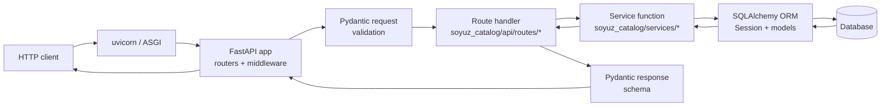

# Architecture

soyuz-catalog is a single-process FastAPI application backed by a single
SQL database (SQLite for development, Postgres for production). There is
no message queue, no background worker, no second service. This page
walks the request lifecycle and points at the matching files in the source
tree.

## Request lifecycle

Every request passes through the same five layers, each with a clear
responsibility.

### 1. Transport — `uvicorn`

A standard ASGI server. soyuz does not embed it; the entry point is a
plain `uvicorn soyuz_catalog.api.main:app`. Any ASGI server works.

### 2. FastAPI application — [`api/main.py`](https://github.com/FloHofstetter/soyuz-catalog/blob/main/soyuz_catalog/api/main.py)

`create_app()` builds the `FastAPI` instance, registers every router,
attaches the `RequestIDMiddleware` (which captures `X-Principal` and
`X-Agent-Run-Id` headers into request-scoped `ContextVar`s for the audit
log), and installs the global exception handler that converts `SoyuzError`
subclasses into the spec-conformant `ErrorResponse` envelope.

Startup is wrapped in a `lifespan` context manager that initialises the DB
and runs Alembic migrations on entry. Multiple replicas against the same
Postgres database are safe because Alembic acquires an advisory lock
before applying any upgrade.

### 3. Routes — `api/routes/*.py`

One module per resource family (`catalogs`, `schemas`, `tables`, `volumes`,
`functions`, `registered_models`, `permissions`, `tags`, `lineage`,
`delta_commits`, …). A route module:

- Declares the URL surface for one resource.
- Validates the request body and path parameters via Pydantic.
- Calls into the matching service module.
- Returns a Pydantic response model that defines the wire shape.

Route handlers are **synchronous** (`def`, not `async def`). The
`get_db` dependency yields a SQLAlchemy `Session` from the module-level
session factory; that session is closed when the request finishes.

### 4. Services — `services/*.py`

Pure-Python functions that take a `Session` plus typed arguments and
return ORM objects. The service layer holds all business logic: cascade
rules, rename invariants, permission inheritance, lineage graph mutation,
delta-commit semantics. Routes are thin; services are where the work
lives. Service functions also raise the typed exceptions (`NotFoundError`,
`AlreadyExistsError`, `InvalidArgumentError`, …) that the global handler
turns into HTTP responses.

### 5. Models — [`models.py`](https://github.com/FloHofstetter/soyuz-catalog/blob/main/soyuz_catalog/models.py)

SQLAlchemy 2.0 declarative models. One module, every table. Foreign
keys mirror the securable hierarchy: catalog → schema → table → column,
with separate top-level tables for volumes, functions, registered models,
audit log, tags, lineage, and so on. Properties on catalog, schema, and
volume are stored as JSON columns rather than a side table — the spec
treats them as opaque string maps.

## Why these layer boundaries

**Routes define the wire shape.** They do not call other routes, they do
not contain logic. Replacing a route module never breaks another module
that calls into the database.

**Services define the work.** They are the only place that touches the
ORM. Tests can call services directly with a `Session` fixture; this is
where most of the unit-level coverage lives, alongside the integration
suite that drives routes through the FastAPI test client.

**Models define the storage.** Migrations under
`soyuz_catalog/alembic/versions/` are the canonical history of every
schema change. The `revision_id` chain is the source of truth — read it
to understand why a column exists.

## Cross-cutting concerns

- **Request validation**: `extra="forbid"` is set on every request model.
  Unknown fields fail with `400 Bad Request`. This is one of the
  documented divergences from UC OSS Java (which silently drops unknown
  fields).
- **Pagination**: keyset cursors, not offset (see
  [ADR-0003](../adr/0003-keyset-pagination.md)). The cursor logic lives
  in `soyuz_catalog/pagination.py` and is reused by every list endpoint.
- **Audit log**: mutation routes call
  `services/audit_service.log_action()` after a successful change. Best
  effort — an audit-write failure logs but does not roll back the
  underlying mutation. See [Observability](../admin/observability.md).
- **Errors**: every service exception is a subclass of `SoyuzError`. The
  global exception handler converts each to the spec's
  `ErrorResponse` envelope with the correct HTTP status. Adding a new
  error class is one place (in `exceptions.py`); the wiring is automatic.

## Where to start reading the code

If you have ten minutes:

1. [`api/main.py`](https://github.com/FloHofstetter/soyuz-catalog/blob/main/soyuz_catalog/api/main.py)
   — see how routers wire up.
2. [`api/routes/catalogs.py`](https://github.com/FloHofstetter/soyuz-catalog/blob/main/soyuz_catalog/api/routes/catalogs.py)
   — the simplest, most spec-canonical resource.
3. [`services/catalog_service.py`](https://github.com/FloHofstetter/soyuz-catalog/blob/main/soyuz_catalog/services/catalog_service.py)
   — see how the work happens.
4. [`models.py`](https://github.com/FloHofstetter/soyuz-catalog/blob/main/soyuz_catalog/models.py)
   — see what the storage looks like.

## See also

- [Stack and interchangeability](stack.md) — why FastAPI, SQLAlchemy,
  Alembic, Pydantic; what is swappable.
- [Spec is the contract](spec-is-the-contract.md) — how the OpenAPI
  document drives validation.
- [Securables and naming](securables-and-naming.md) — the data model's
  hierarchy.
- [ADR-0001](../adr/0001-stack-and-conventions.md) — the foundational
  stack decision.
