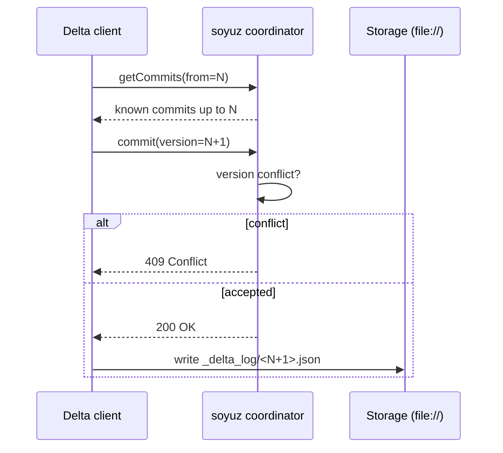

# Delta commit handling

Unity Catalog's `POST /delta/preview/commits` endpoint is the
*commit coordinator* surface: a client that wants to write a new Delta
version asks the catalog to coordinate the commit so that concurrent
writers cannot collide. soyuz implements this endpoint as a
**passthrough coordinator** — it tracks commit attempts, rejects
conflicts, and lets the client write the actual Delta log file. soyuz
itself never opens `_delta_log/`.

The formal decision is [ADR-0011](../adr/0011-delta-commit-coordinator.md),
which supersedes the earlier
[ADR-0006](../adr/0006-coordinated-commits.md) ("no coordinator at all").

## What the spec says

The `POST /delta/preview/commits` endpoint takes:

- The table being committed against (by `table_id`).
- The proposed version number.
- The commit metadata (operation, parameters, timestamp).
- Whether this is a *prune* request, a *commit* request, or both.

It returns one of:

- `200 OK` — the commit is accepted; the client may write the Delta log
  file at the assigned version.
- `409 Conflict` — another writer already committed at this version.
  The client retries with the next version.
- `400 BAD_REQUEST` — semantic error in the commit payload.
- `429 Too Many Requests` — back off and retry.
- `422 Unprocessable Entity` — Pydantic validation failure.
- `501 Not Implemented` — used historically when soyuz returned this
  endpoint as a stub; the production server should never return 501 for
  this surface.

## What passthrough means

soyuz tracks every commit *attempt* in the `delta_commits` table:
`table_id`, `version`, `metadata`, `created_at`, and a status flag. When
a client asks to commit version N:

1. soyuz checks if version N is already taken for this table.
   - If yes: return `409 Conflict`. The client retries with N+1.
   - If no: record the attempt and return `200 OK`. The client now owns
     this version and must write the Delta log file to storage.
2. soyuz does **not** read or write the storage location. The client
   handles file IO directly.

This is *passthrough* because soyuz never touches the data path. The
coordinator role is purely advisory: it serializes version numbers
across concurrent writers, nothing more.

## Why not a full coordinator

A *full* coordinator would write the Delta log file itself, guaranteeing
atomicity even when the client crashes between getting the version
assignment and writing the file. soyuz could implement this, but it
would mean:

1. Embedding cloud storage credentials in the soyuz process (S3, ABFSS,
   GCS).
2. Handling partial writes, retries, and orphan recovery.
3. Owning a code path for every storage backend Delta supports.

The cost is high and the benefit is reachable through other means: a
client that crashes mid-commit can be detected by an *unbackfilled
commit* — a row in `delta_commits` whose corresponding Delta log file
does not exist. The next reader notices the gap and treats the version
as failed.

Passthrough trades coordinator atomicity for backend independence. The
trade is appropriate for soyuz's metadata-only stance ([README design
principle 3](https://github.com/FloHofstetter/soyuz-catalog/blob/main/README.md)).

## Storage scheme support

soyuz tracks commit metadata for any URL scheme — `file://`, `s3://`,
`abfss://`, `gs://`. The coordinator role is symmetric across schemes
because soyuz never touches storage; it is the **client's** responsibility
to write the log file.

The compatibility test
([`tests/test_delta_commits.py`](https://github.com/FloHofstetter/soyuz-catalog/blob/main/tests/test_delta_commits.py))
exercises the full contract — happy path, `409`, `400`, `429`, prune, and
combined commit + prune — at the HTTP level. That fixture covers the
*soyuz side* of the contract; the *client side* is covered by the
real-client integration tests in
[`tests/test_spark_compatibility.py`](https://github.com/FloHofstetter/soyuz-catalog/blob/main/tests/test_spark_compatibility.py).

## Unbackfilled commits

A commit recorded in `delta_commits` whose Delta log file never landed
is called *unbackfilled*. The table `delta_unbackfilled_commits` tracks
them. Two reasons one might exist:

1. **Crash between assignment and write.** The client got `200 OK` but
   never wrote the file. The version is "burned" — readers see a gap.
2. **Out-of-order commit.** The client wrote version N+1 before N (rare
   but possible with retried operations).

soyuz exposes these as a debugging aid; they are not normally consumed
by readers. A future admin tool may surface them, but the read path
already handles gaps gracefully — Delta's protocol allows missing
versions provided the latest one is reachable.

## See also

- [Walkthrough: posting a Delta commit](../guides/walkthroughs/delta-commit.md)
  — concrete HTTP sequence.
- [Apache Spark integration](../integrations/spark.md) — how Spark's
  `unitycatalog-spark` connector relates (managed-Delta is currently an
  upstream gap).
- [delta-rs integration](../integrations/delta-rs.md) — the Python
  client that drives the coordinator directly.
- [ADR-0011](../adr/0011-delta-commit-coordinator.md) — the formal
  decision.
- [ADR-0006](../adr/0006-coordinated-commits.md) — the prior decision
  superseded by 0011.
