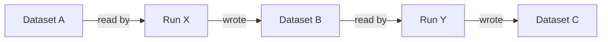

# Lineage

Lineage in soyuz-catalog is the persisted record of how data moves between
securables: which jobs read what, which jobs wrote what, and — when the
producer reports it — which input column flows into which output column.
soyuz speaks the [OpenLineage](https://openlineage.io/) ingest format and
adds graph-traversal endpoints on top.

The formal decision to anchor on OpenLineage rather than invent a soyuz-
native format is [ADR-0008](../adr/0008-openlineage-as-lineage-contract.md).

## What gets ingested

The producer (Spark, Airflow, dbt, a custom script, anything that emits
OpenLineage events) posts `RunEvent` payloads to `POST /lineage`. A
RunEvent describes a single job run with:

- A **run identifier** — typically a UUID per job execution.
- A **job descriptor** — `namespace` + `name`.
- One or more **input datasets** the run read.
- One or more **output datasets** the run wrote.
- Optionally a **column lineage facet** mapping output column names back
  to input column names.
- Optionally a **value-level facet** (custom; see below).

soyuz dedupes by run UUID. Posting the same RunEvent twice yields one
graph node; an updated event (e.g. with additional outputs discovered
mid-run) merges with the existing record.

## The stored graph

Three tables back the graph:

| Table | Role |
|---|---|
| `lineage_run` | One row per OpenLineage run UUID. Stores job metadata + status. |
| `lineage_edge` | Dataset-level edges: a run *read* dataset X and *wrote* dataset Y. |
| `lineage_column_edge` | Column-level edges: dataset X column `a` → dataset Y column `b`. |
| `lineage_value_change` | Custom value-level facet capturing row deltas. |

Datasets in OpenLineage are referenced by `namespace + name`. soyuz
resolves common namespaces (`spark://`, `delta://`, `s3://`, …) to soyuz
securables when the dataset corresponds to a registered table. Unresolved
datasets are kept verbatim in the edge rows so traversal still works
across the boundary into external data.

## Traversal

Two read endpoints walk the graph:

- `GET /lineage/upstream/...` — given a securable, return the set of
  runs and datasets that fed into it.
- `GET /lineage/downstream/...` — the inverse: what consumed this
  securable.

Both support a `depth` parameter. The default depth is small (3) because
lineage graphs explode quickly and the most common question is *"what
just changed?"*, not the full transitive closure.

Column lineage is opt-in: a `column` query parameter narrows the result
to edges that touch that column. With no column parameter, the response
is at dataset granularity.

*Upstream = walk left, Downstream = walk right (bounded by `?depth=N`).*

## Why OpenLineage

OpenLineage is the de-facto open standard for lineage transport. Its
JSON-LD payload format is implemented by Spark, Airflow, dbt, Flink,
Great Expectations, and several smaller producers. Adopting it means
soyuz integrates with the existing ecosystem without asking producers to
ship a second emitter.

The alternative — defining a soyuz-native lineage shape — would force
every producer to implement two emitters. Even if soyuz were the only
lineage consumer, the maintenance cost of staying aligned with the
producers' evolving lineage shape would outweigh any gain from a custom
format.

## What soyuz does *not* do

- **No execution.** soyuz does not run jobs and does not derive lineage
  from observed data. Lineage in soyuz is **declared** by the producer.
- **No mutation by clients.** Lineage is append-only from the API
  perspective. There is no `DELETE /lineage/...`; pruning is an admin
  operation against the database directly when it is needed.
- **No automatic schema-change inference.** Renaming a column does not
  rewrite existing column-lineage edges. Edges reference column names as
  they were at ingest time; a producer that emits new RunEvents after a
  rename will land new edges next to the old ones.

## See also

- [Walkthrough: posting and traversing lineage](../guides/walkthroughs/lineage.md)
  — concrete HTTP example.
- [Extensions over the spec](extensions-over-spec.md) — how lineage fits
  in the broader extension picture.
- [ADR-0008](../adr/0008-openlineage-as-lineage-contract.md) — the
  decision.
- [OpenLineage docs](https://openlineage.io/docs/) — upstream
  specification.
