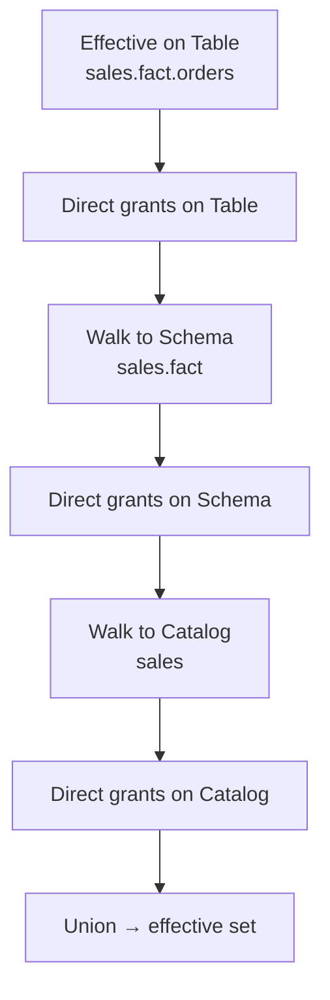

# Permissions model

soyuz-catalog implements the spec's permission surface — direct grants,
effective (inherited) computation — but it does **not** enforce any of
them. A request with no credentials and a request from an unprivileged
principal receive the same response. This is by design; the formal
decision is [ADR-0005](../adr/0005-permissions-without-enforcement.md).

This page explains the model, why enforcement lives one layer up, and how
to read effective-permission responses.

!!! warning "soyuz computes, the proxy enforces"

    soyuz returns effective grants on request but never blocks a mutation.
    Auth and enforcement are the front-proxy's job. See
    [ADR-0005](../adr/0005-permissions-without-enforcement.md).

## Direct grants

A direct grant is a row in the `permissions` table:

```text
principal:    "alice@example.com" | "agroup" | "soyuz-engineering"
securable:    catalog | schema | table | volume | function | model
privilege:    SELECT | MODIFY | CREATE_TABLE | USE_CATALOG | ...
```

Routes:

- `GET /permissions/{type}/{full_name}` — list direct grants on one
  securable.
- `PATCH /permissions/{type}/{full_name}` — additive add/remove on the
  grant list.

Grants are stored verbatim. soyuz does not validate the privilege
vocabulary against a closed set — the spec lists the standard verbs
(`SELECT`, `MODIFY`, `CREATE_TABLE`, …) but does not forbid custom
privileges, and rejecting unknown values would break clients that already
use them. The route layer enforces the structural shape; the value is a
string.

## Effective permissions

The `GET /effective-permissions/{type}/{full_name}` endpoint returns the
union of:

- Direct grants on the securable itself.
- Direct grants on every ancestor in the hierarchy (catalog → schema → table).

This is what authorization layers actually want: *"what privileges does
this principal hold here, considering inheritance?"*. The computation
lives in `soyuz_catalog/services/permissions_service.py` and walks the
parent chain once per call.

A direct grant on a catalog with privilege `SELECT` propagates as
effective `SELECT` to every schema and table under that catalog. Removing
the direct grant invalidates the effective row immediately — soyuz does
not cache effective computations.



## Why no enforcement

soyuz is a metadata server, not a gateway. The deployment pattern is:

```text
[ clients ] --> [ auth proxy / IdP ] --> [ soyuz ]
```

The proxy authenticates the request, attaches identity headers
(`X-Principal`, `X-Agent-Run-Id`), and decides whether to forward the
call at all. soyuz then services the request, records the principal in
the audit log, and returns the spec-correct response.

Pushing enforcement into soyuz would mean:

1. Embedding an authentication layer (OAuth, OIDC, SAML, mTLS, …).
2. Embedding a session model.
3. Embedding a policy engine that knows when `MODIFY` on a column implies
   `SELECT` on the table.

Each is a large surface and is already solved better by dedicated tools
(proxy + IdP + OPA/Casbin/Cedar/Ory). soyuz keeps the metadata pure and
lets the operator pick the auth stack.

## What soyuz does provide

Three things make this stance workable:

1. **Identity capture.** Mutation routes record the `X-Principal` header
   in the audit log so an external proxy's decisions are traceable.
2. **Effective computation.** The proxy or policy engine can ask soyuz
   *"what privileges does Alice hold on `sales.fact.orders`?"* and get a
   complete inherited answer — no need to re-implement the inheritance
   walk.
3. **No cache, no staleness.** Effective answers are computed on demand,
   so a grant change is visible to the next call. Policy engines that
   cache aggressively need to invalidate on `PATCH /permissions`.

## Reading an effective-permissions response

```json
{
  "privilege_assignments": [
    {
      "principal": "alice@example.com",
      "privileges": [
        {"privilege": "SELECT",         "inherited_from_type": "catalog", "inherited_from_name": "sales"},
        {"privilege": "MODIFY",         "inherited_from_type": "schema",  "inherited_from_name": "sales.fact"},
        {"privilege": "USE_CATALOG",    "inherited_from_type": "catalog", "inherited_from_name": "sales"}
      ]
    }
  ]
}
```

`inherited_from_*` is non-null when the grant came from an ancestor. A
direct grant on the queried securable has these fields null. This shape
is the spec's; soyuz does not extend it.

## See also

- [Securables and naming](securables-and-naming.md) — the hierarchy that
  inheritance walks.
- [Walkthrough: grants and effective permissions](../guides/walkthroughs/grants-and-effective.md)
  — concrete HTTP sequence.
- [Observability and audit log](../admin/observability.md) — how
  `X-Principal` ends up in the audit trail.
- [ADR-0005](../adr/0005-permissions-without-enforcement.md) — the
  decision.
