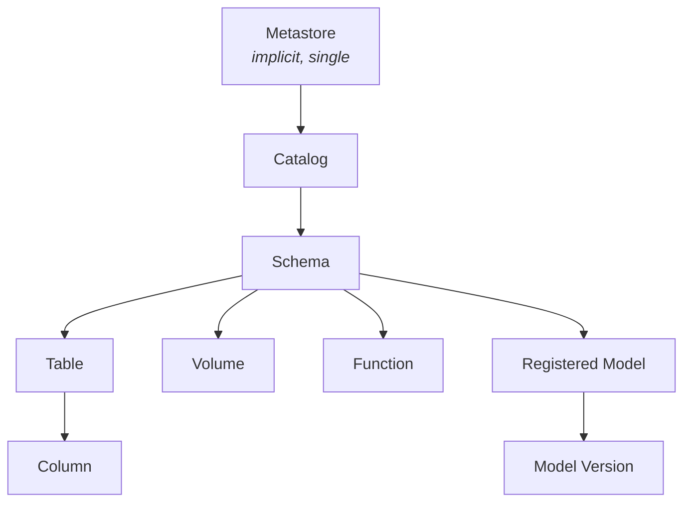

# Securables and naming

A *securable* in Unity Catalog terminology is any object that can be the
subject of a grant or a tag — a catalog, a schema, a table, a volume, a
function, a registered model, a column. soyuz follows the same model. This
page explains the hierarchy, the naming rules that fall out of it, and the
rename semantics that keep extensions (tags, lineage) attached when a
user-facing name changes.

## The hierarchy



Three observations matter:

1. **Catalog and Schema are namespace nodes**, not leaves. Their job is to
   group child resources and propagate grants and tags down the tree.
2. **Tables, Volumes, Functions, Models are sibling leaves** under a
   schema. They are addressable independently but share a namespace.
3. **Columns are not addressable as top-level resources**; they live
   inside a Table and are referenced by `<catalog>.<schema>.<table>.<column>`.

## Names

Every resource has a `name` and a `full_name`. The `full_name` is what
clients pass on the wire; the `name` is the leaf segment.

| Resource | `full_name` form | Example |
|---|---|---|
| Catalog | `<catalog>` | `sales` |
| Schema | `<catalog>.<schema>` | `sales.fact` |
| Table | `<catalog>.<schema>.<table>` | `sales.fact.orders` |
| Volume | `<catalog>.<schema>.<volume>` | `sales.staging.uploads` |
| Function | `<catalog>.<schema>.<function>` | `sales.fact.fx_to_usd` |
| Registered Model | `<catalog>.<schema>.<model>` | `sales.ml.churn` |
| Column | `<catalog>.<schema>.<table>.<column>` | `sales.fact.orders.customer_id` |

URL routes mirror the hierarchy:

- `GET /catalogs/{catalog}` — single segment.
- `GET /schemas/{catalog.schema}` — two segments, dot-joined.
- `GET /tables/{catalog.schema.table}` — three segments.
- `PATCH /tags/column/{catalog.schema.table.column}` — four segments, only
  valid for columns.

The `tags` and `lineage` extension routes use the same convention with a
`type` discriminator: `/tags/<type>/<full_name>` where `type` is one of
`catalog`, `schema`, `table`, `column`.

## Names vs IDs

Each securable also has an opaque UUID `id`. Names are user-facing and
mutable; IDs are persistent and never reused. This split lets soyuz support
**rename without breaking attachment**.

Consider a tag attached to a table:

```text
Tag row:
  securable_id   = "a8b7c6d5-…"  (the table's UUID)
  key            = "layer"
  value          = "bronze"
```

When the table is renamed from `orders` to `orders_v2`, only the `name`
column changes. The `id` stays. The tag is still attached because it
references the ID, not the name. Same for inherited grants and lineage
edges.

This is the reason `tests/test_tags.py::test_rename_catalog_preserves_tags`
exists: it pins the invariant that a tag survives a parent rename.

## Three-part vs four-part names

Two-part schema names (`catalog.schema`) and three-part table/volume/
function/model names are standard. The four-part form is exclusive to
columns and only appears in tags + lineage routes. The
[Tags walkthrough](../guides/walkthroughs/tags.md) demonstrates the
distinction in concrete HTTP calls.

A four-part path against a non-column securable type returns
`400 BAD_REQUEST`. A three-part path against `column` returns the same.
Validation lives at the route layer in `soyuz_catalog/api/routes/tags.py`
and `lineage.py`.

## Naming rules

Names follow the spec's regex (`[A-Za-z0-9_]+`, no dots). Dots inside a
name would break dot-joined parsing; this is enforced by Pydantic
validation on the request body.

Empty names, names with leading/trailing whitespace, or names containing
control characters are rejected with `400 BAD_REQUEST` — soyuz does not
trim or sanitize, on the principle that the client should fix the input.

## Cascade rules

Deleting a parent securable does not silently delete children. soyuz
follows the spec's `force` flag pattern:

- `DELETE /schemas/{catalog.schema}` with a non-empty schema returns
  `400 BAD_REQUEST` unless `force=true`.
- `DELETE /catalogs/{catalog}` with non-empty schemas returns the same
  unless `force=true`.

Tags and lineage rows attached to a deleted securable are *not*
cascade-deleted — they remain in the database as orphan rows. The
read path resolves names to securables and 404s when the parent is
gone, so orphans are unreachable but discoverable through direct database
inspection. This append-only posture is intentional: it means a soyuz
audit log can reconstruct the full history of a key even after the
keyed-on resource is dropped.

## See also

- [Permissions model](permissions-model.md) — how grants inherit down the
  hierarchy.
- [Extensions over the spec](extensions-over-spec.md) — tags and lineage
  build on the rename-invariant ID model.
- [REST API reference](../reference/api.md) — exact path patterns per
  resource.
- [ADR-0010](../adr/0010-tags-as-extension.md) — why tags are anchored on
  opaque IDs.
