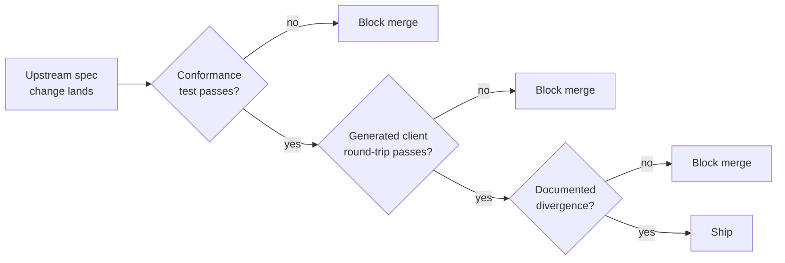

# Spec is the contract

The single most consequential design choice in soyuz-catalog is which
artifact counts as authoritative when two sources of truth disagree:

- The [OpenAPI document](https://github.com/unitycatalog/unitycatalog/blob/main/api/all.yaml)
  at `unitycatalog/api/all.yaml`.
- The behaviour of the Java reference server at `unitycatalog/server/`.

soyuz picks the spec. The Java server is a behaviour reference — useful
because real clients have been tested against it — but it is *not* the
contract. This page describes how that rule plays out in practice. The
formal decision is [ADR-0002](../adr/0002-spec-is-the-contract.md).

## What this means at the wire level

Three concrete consequences.

### 1. `extra="forbid"` on every request body

Pydantic's `model_config = ConfigDict(extra="forbid")` is set on every
request model in `soyuz_catalog/api/schemas.py`. An unknown field fails
with `422 Unprocessable Entity` and a precise error message naming the
offending field.

The Java server silently drops unknown fields. That is the single most
common bug class soyuz exists to fix: silent drops mean a typo in
`{"propeerties": {...}}` is indistinguishable from a successful no-op,
which is how clients quietly lose data.

### 2. Replace-style PATCH means *replace*

When the spec defines a `PATCH` body as a partial replacement, soyuz
treats every field present in the body as a write — including
`properties={}`, which clears the properties map. Fields absent from the
body are left untouched.

The Java server treats `properties={}` as a no-op. That has the surprising
consequence that there is no documented way to clear all properties
without dropping and recreating the resource. soyuz fixes this
([documented divergence](../divergences.md), with a regression test in
`tests/test_catalogs.py`).

### 3. Status codes match the spec exactly

`404` means the resource was not found. `409` means a conflict (typically
a duplicate name). `422` means a Pydantic validation error.
`400 BAD_REQUEST` is reserved for spec-defined semantic errors. Where the
Java server returns `500` for what is actually a client error, soyuz
returns the spec-correct status.

## How this is enforced day to day

Spec-conformance would rot fast without machinery. soyuz has three gates.

### Gate 1 — OpenAPI conformance test

`tests/test_openapi_conformance.py` walks every path in
`unitycatalog/api/all.yaml` and asserts that soyuz mounts a matching
FastAPI route. A new spec endpoint that soyuz does not yet implement
fails CI; a soyuz route that is not in the spec must either be an
explicit extension (listed in [Extensions over the spec](extensions-over-spec.md)
and excluded from the test) or be removed.

This is the cheapest gate and the most important: it catches drift the
moment a spec update lands or a route is renamed.

### Gate 2 — Generated client round-trip

soyuz ships an in-tree client generated from the live `/openapi.json` by
[`openapi-python-client`](https://pypi.org/project/openapi-python-client/).
The test at `tests/test_generated_client_roundtrip.py` exercises every
resource through the generated client. A backwards-incompatible change to
the wire shape breaks regeneration; a runtime serialization difference
breaks the round-trip test.

The reasoning behind shipping a generated client rather than a
hand-written one is in [ADR-0007](../adr/0007-generated-client-over-hand-written-sdk.md).

### Gate 3 — Documented divergences

Every behaviour difference from the Java server is documented in
[`DIVERGENCES.md`](../divergences.md) with three required ingredients:

1. The spec quotation that justifies the choice.
2. The Java-server behaviour being replaced.
3. The regression test name that pins it.

No divergence without a test, no behaviour change without a divergence
entry. This is enforced socially (PR review) rather than mechanically,
but the convention is documented in `CLAUDE.md`.

## When the spec is silent

The spec is sometimes ambiguous — fields without examples, error codes
left to the implementer, edge cases not covered. soyuz makes the choice
that:

1. Respects replace-style PATCH semantics consistently across resources.
2. Rejects malformed requests rather than silently dropping data.
3. Returns the most specific status code that is correct (`409` over
   `400` for a duplicate, `400` over `422` for a semantic violation,
   `404` over `403` for unknown securables).

Choices made under ambiguity are also recorded in `DIVERGENCES.md`. They
are divergences *from the Java server* even when the spec itself does not
constrain the choice — clients that target Databricks-style behaviour
need to know which way soyuz jumps.

## Why this rule matters

The alternative — treating the Java server as the contract — would mean
inheriting every silent bug and asking soyuz users to choose between
"compatible with the Java server" and "behaves correctly". With the spec
as the contract, the choice is collapsed: behaving correctly *is*
behaving compatibly, because the spec is what every client is written
against.

## See also

- [Origin and relationship to Unity Catalog](origin.md) — concrete
  examples of Java-server bugs soyuz fixes.
- [Divergences](../divergences.md) — the canonical list, with regression
  tests.
- [Spec coverage map](../reference/spec-coverage.md) — what is implemented
  and how completely.
- [ADR-0002](../adr/0002-spec-is-the-contract.md) — the formal decision.
- [ADR-0007](../adr/0007-generated-client-over-hand-written-sdk.md) — why
  the in-tree client is generated.
